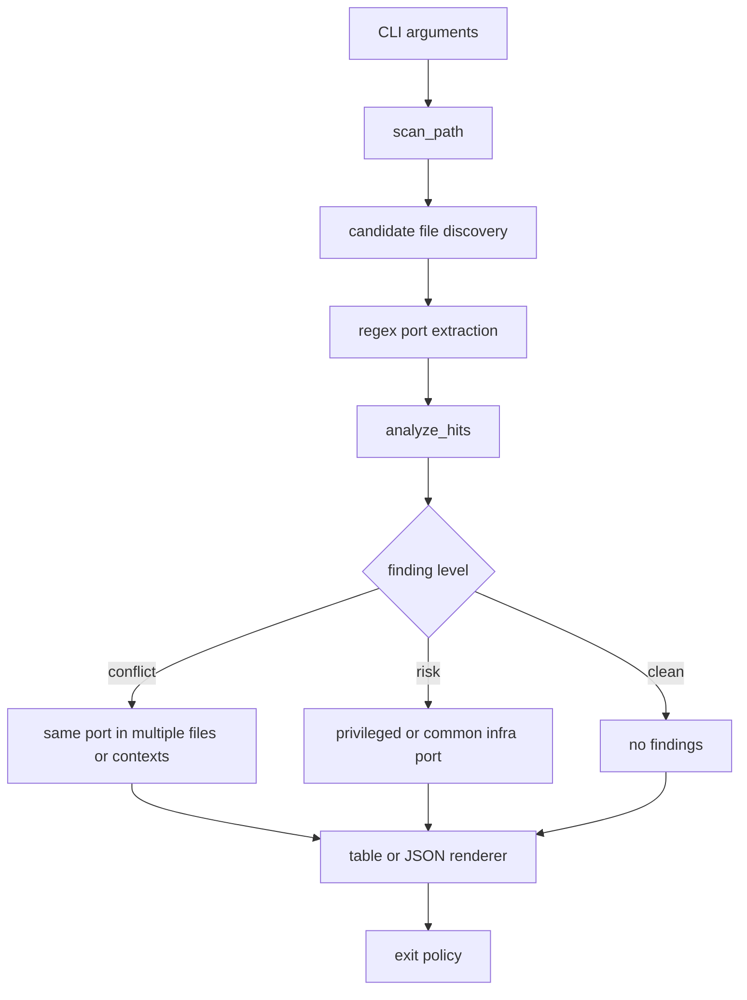

# port-map-audit

Find local port collisions before Docker, reverse proxies, test servers, and app configs fight over the same socket.


## What It Checks

| Signal | Example | Why it matters |
| --- | --- | --- |
| URLs | `http://localhost:8080` | catches hard-coded service endpoints |
| env assignments | `API_PORT=8080` | finds runtime settings |
| Docker mappings | `"8080:80"` | detects host port reuse |
| listeners | `listen 127.0.0.1:443` | flags proxy/server bindings |

## Install

```bash
git clone https://github.com/mertefekurt/port-map-audit.git
cd port-map-audit
python3 -m pip install .
```

## Usage

```bash
port-map-audit .
port-map-audit ./infra --format json
port-map-audit . --fail-on risk
```

## CLI Reference

| Argument / flag | Default | Purpose |
| --- | ---: | --- |
| `path` | `.` | Directory or file to scan |
| `--format table\|json` | `table` | Human output or machine-readable JSON |
| `--fail-on none\|risk\|conflict` | `conflict` | CI exit policy |
| `--include-hidden` | `false` | Include hidden files and folders |
| `--max-size bytes` | `256000` | Skip very large files |
| `--extension ext` | none | Include extra file extensions |

## Architecture



## Project Layout

| Path | Role |
| --- | --- |
| `src/port_map_audit/scanner.py` | file discovery and port extraction |
| `src/port_map_audit/analyzer.py` | conflict and risk classification |
| `src/port_map_audit/renderers.py` | table and JSON output |
| `src/port_map_audit/cli.py` | argparse entrypoint and exit policy |
| `tests/` | unit tests for scanner and CLI policy |

## Test

```bash
PYTHONPATH=src python3 -m unittest discover -s tests
```
