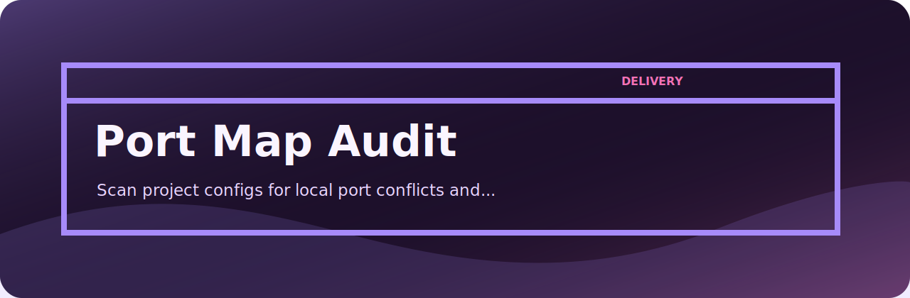
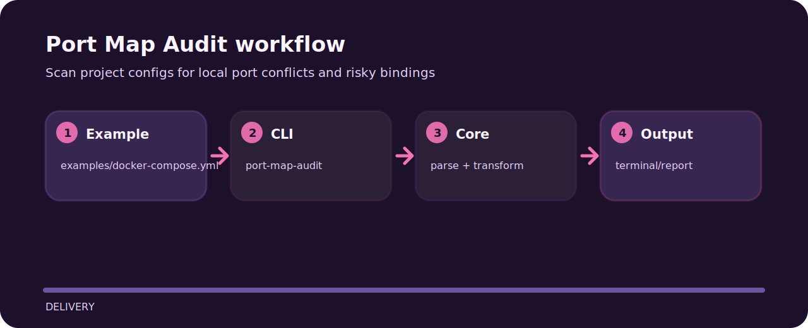

# Port Map Audit



## Shape of the tool



## Try the sample

```bash
git clone https://github.com/mertefekurt/port-map-audit.git
cd port-map-audit
python -m pip install -e ".[dev]"
port-map-audit examples/docker-compose.yml
```

## Useful details

Port Map Audit focuses on one practical job in delivery. The README below is arranged around the shortest path from clone to result.

| Detail | Value |
| --- | --- |
| Area | delivery |
| Entry | `port-map-audit` |
| Input | YAML snippet |
| Output | readable terminal output |
