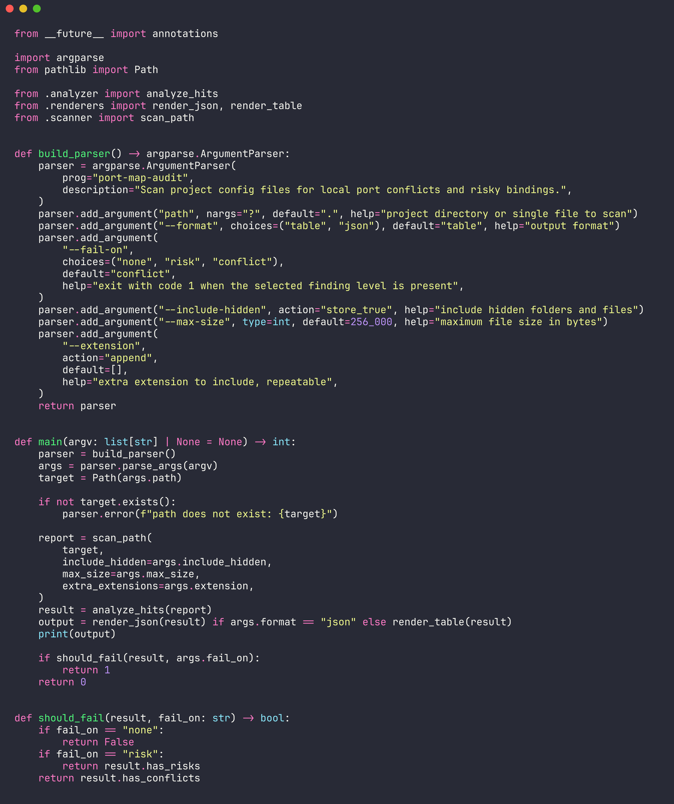
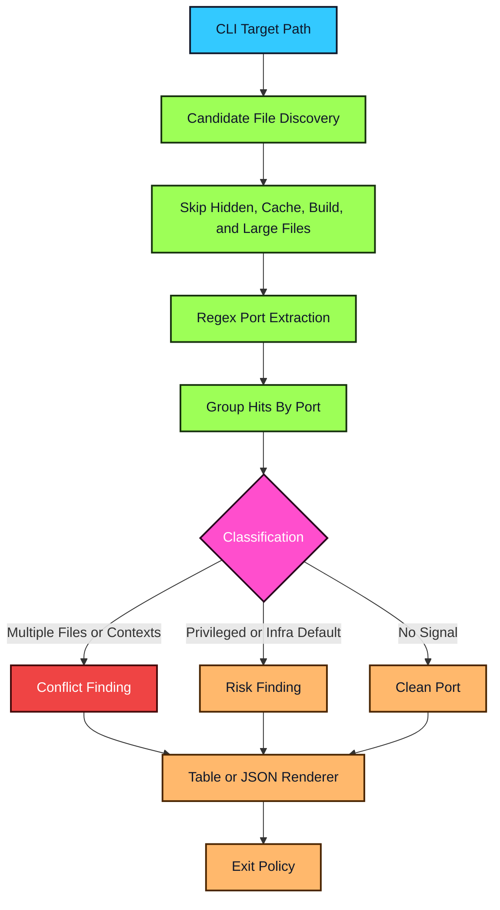

<div align="center">


</div>


`port-map-audit` scans project files for URLs, environment assignments, Docker host mappings, and listener directives that mention local ports. It turns scattered configuration into a clear conflict report so development stacks fail in review instead of at runtime.

<table>
  <tr>
    <td width="50%" valign="top">


- 🔌 Finds duplicate ports across config files and contexts
- 🐳 Detects Docker Compose and Dockerfile-style host mappings
- 🌐 Extracts ports from HTTP, WebSocket, TCP, and UDP URLs
- ⚠️ Flags privileged ports and common infra defaults
- 🧾 Renders human tables or machine-readable JSON
- 🚦 Supports CI exit policies for risk or conflict thresholds

  </td>
  <td width="50%" valign="top">



  </td>
  </tr>
</table>





```bash
git clone https://github.com/mertefekurt/port-map-audit.git
cd port-map-audit
python3 -m pip install .
port-map-audit .
```

<details>
<summary>🛠️ View CLI Reference / Advanced Config</summary>

| Command | Purpose |
| --- | --- |
| `port-map-audit .` | Scan the current project and print a table |
| `port-map-audit ./infra --format json` | Scan infrastructure files and emit JSON |
| `port-map-audit . --fail-on risk` | Exit non-zero when risks or conflicts are present |
| `port-map-audit . --include-hidden` | Include hidden files and folders in discovery |

| Flag | Default | Purpose |
| --- | ---: | --- |
| `path` | `.` | Directory or file to scan |
| `--format table\|json` | `table` | Choose human or machine output |
| `--fail-on none\|risk\|conflict` | `conflict` | Select the CI failure threshold |
| `--include-hidden` | `false` | Include dotfiles and hidden folders |
| `--max-size <bytes>` | `256000` | Skip files larger than this value |
| `--extension <ext>` | none | Add an extra extension to scan, repeatable |

| Signal | Example |
| --- | --- |
| URL ports | `http://localhost:8080` |
| Environment assignments | `API_PORT=8080` |
| Docker mappings | `"8080:80"` |
| Listener directives | `listen 127.0.0.1:443` |

</details>


```text
port-map-audit/
├── src/port_map_audit/
│   ├── cli.py        # argparse entrypoint and exit policy
│   ├── scanner.py    # file discovery and port extraction
│   ├── analyzer.py   # conflict and risk classification
│   ├── renderers.py  # table and JSON output
│   └── models.py     # report and finding data structures
├── examples/
├── tests/
└── assets/
    └── code-snapshot.png
```


MIT
